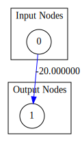
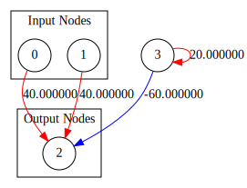
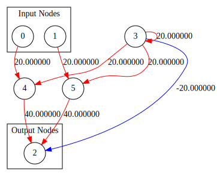

# Evolutional-Graph-Neural-Network
T_EvolutionGraphNN.h is a C++ library which simulates graph neural networks and their evolution process.

***

## Table of Content
- [Introductions](#Introductions)
- [Requirements](#Requirements)
- [Examples](#Examples)
    - [Basic Usages](#Basic-Usages)
    - [Logic Gates](#Logic-Gates)
        - [NOT Gate](#NOT-Gate)
        - [AND Gate](#AND-Gate)
        - [OR Gate](#OR-Gate)

***

## Introductions
This library is created to simulate graph neural networks in a time-step manner. The library allowed users to create, configure, run, save, load and visualize graph neural networks, as well as simulate evolution process of the network by inheritance, and mutations.

As this library simulates graph neural networks in a time-based manner, neural networks with cycles are allowed to exist.


***

## Requirements

### Linux
- [x] g++
    - Install **g++** by running ```sudo apt install g++ -y``` in linux terminal.
- [x] Make
    - Install **make** by running ```sudo apt install make -y``` in linux terminal.
- [x] Graphviz
    - Install **graphviz** by running ```sudo apt install graphviz -y``` in linux terminal.

***

## Examples
(To be continued)
### Basic Usages
To use the EvolutionGNN library, we just need to include the header file in our code:
```cpp
#include "T_EvolutionGraphNN.h"
```
To compile the program using **g++**, we need to include the **-lpthread** option since EvolutionGNN supports multi-thread execution.
```bash
g++ your_cpp_file.cpp -o your_desired_executable_name -lpthread
```

The test code of EvolutionGraphNN is included in the [src](./src) folder.

To compile and run the test code, follow these steps:

1. Open the terminal in the **Evolutional-Graph-Neural-Network** folder.
1. Navigate to the **src** folder in the terminal by typing `cd src/` and hit **Enter**.
1. Compile the executable by typing `make` and hit **Enter** in the terminal.
1. Run the compiled executable and generate .svg of test models by typing `make run` and hit **Enter** in the terminal.


### Logic Gates

In this section, I'll demonstrate that the graph neural network is able to act as logic gates.

Since the activation of the neural network is ***tanh***, we can expect that the output of each neuron will be bounded in **(-1.0, 1.0)**. To take advantage of this feature, we will define **True** as **1**, and **False** as **-1** for the neural network.

#### **NOT Gate**
To create a **Not Gate**, we can simply flip the input of a neuron. So the architecture will be like this:

<p align="center"> 

</p>

To create such neural network, we should define the network to have **1 input node** and **1 output node**:

```cpp
//Create a Not Gate network
EvolutionGNN<float> notGate;

//Set the network to have 1 input node and 1 output node
notGate.initialize(1, 1);

//Not Gate only requires 1 connection, with a large negative weight
//Since we only have 1 input node, the id of input node will be 0
//Since we only have 1 output node, the id of output node will be (#input_nodes + 0), which is 1
notGate.addConnection(0, 1, -20.0);
```

And that completes the building of **Not Gate** with EvolutionGNN.


To test if the **Not Gate** runs as expected, we make 2 test cases.

The first one with input set to -1.0 (false):
```cpp
//Set input indexed at 0 to -1.0
notGate.setInput(0, -1.0);
```
We then run the notGate for 10 times:
```cpp
for(int i = 0; i < 10; ++i) {
    //Run the simulation for 1 time frame
    notGate.run();

    //Flip internal buffer
    notGate.flipBuffer();

    //Show the output at index -
    std::cout << notGate.getOutput(0) << ' ';
}
std::cout << std::endl;
```
The outcome will looks like this
```
0 1 1 1 1 1 1 1 1 1
```

Another test case is with input set to 1.0 (true):
```cpp
//Set input indexed at 0 to 1.0
notGate.setInput(0, 1.0);
```
We again run the notGate for 10 times:
```cpp
for(int i = 0; i < 10; ++i) {
    //Run the simulation for 1 time frame
    notGate.run();

    //Flip internal buffer
    notGate.flipBuffer();

    //Show the output at index 0
    std::cout << notGate.getOutput(0) << ' ';
}
std::cout << std::endl;
```
The outcome will looks like this
```
0 -1 -1 -1 -1 -1 -1 -1 -1 -1
```
These proved that our **Not Gate** works!


#### **AND Gate**
To create an **And Gate**, the architecture is a bit more complicated than **Not Gate**. Which looks like this:

<p align="center"> 

</p>

One thing to note is that **node #3** is not a normal node. It acts as a *bias*, and constantly output 1 so that when its multiplied by -60.0 it constantly output -60.0. The reason for this is that we want **And Gate** only turns on (outputs 1) when both inputs are **True** (1) but not when only one of the inputs is **True**.  

To create such neural network, we should define the network to have **2 input nodes** and **1 output node**:

```cpp
//Create a And Gate network
EvolutionGNN<float> andGate;

//Set the network to have 2 input node and 1 output node
andGate.initialize(2, 1);

//And Gate requires 4 connections
//We first create connections from input nodes to output node
//Since we have two input nodes, their node id will be 0 and 1
//Since we have 1 output node, it's node id will be (#input_nodes + 0), which is 2
andGate.addConnection(0, 2, 40.0);
andGate.addConnection(1, 2, 40.0);

//We then create a loop back connect for node 3 and make sure it initials 
//with both buffers set to 1.0 so that the node will always output 1.0
andGate.addConnection(3, 3, 20.0, 1.0, 1.0);

//Finally, we add the connection from node 3 to output node
andGate.addConnection(3, 2, -60.0);
```

And that completes the building of **And Gate** with EvolutionGNN.

To test if the **And Gate** runs as expected, we make 3 test cases.

The first one with both inputs set to -1.0 (false):
```cpp
//Set input indexed at 0 to -1.0
andGate.setInput(0, -1.0);
//Set input indexed at 1 to -1.0
andGate.setInput(1, -1.0);
```
We then run the andGate for 10 times:
```cpp
for(int i = 0; i < 10; ++i) {
    //Run the simulation for 1 time frame
    andGate.run();

    //Flip internal buffer
    andGate.flipBuffer();

    //Show the output at index -
    std::cout << andGate.getOutput(0) << ' ';
}
std::cout << std::endl;
```
The outcome will looks like this
```
0 -1 -1 -1 -1 -1 -1 -1 -1 -1
```

Another test case is with inputs set to -1.0 (false) and 1.0 (true) respectively:
```cpp
//Set input indexed at 0 to -1.0
andGate.setInput(0, -1.0);
//Set input indexed at 1 to 1.0
andGate.setInput(1, 1.0);
```
We again run the notGate for 10 times:
```cpp
for(int i = 0; i < 10; ++i) {
    //Run the simulation for 1 time frame
    andGate.run();

    //Flip internal buffer
    andGate.flipBuffer();

    //Show the output at index -
    std::cout << andGate.getOutput(0) << ' ';
}
std::cout << std::endl;
```
The outcome will looks like this
```
0 -1 -1 -1 -1 -1 -1 -1 -1 -1
```

In the last test case, we set both inputs to 1 (true):
```cpp
//Set input indexed at 0 to 1.0
andGate.setInput(0, 1.0);
//Set input indexed at 1 to 1.0
andGate.setInput(1, 1.0);
```
We again run the notGate for 10 times:
```cpp
for(int i = 0; i < 10; ++i) {
    //Run the simulation for 1 time frame
    andGate.run();

    //Flip internal buffer
    andGate.flipBuffer();

    //Show the output at index -
    std::cout << andGate.getOutput(0) << ' ';
}
std::cout << std::endl;
```
The outcome will looks like this
```
0 1 1 1 1 1 1 1 1 1
```
These proved that our **And Gate** works!

#### **OR Gate**

To create an **Or Gate**, the architecture is a bit more complicate than **And Gate**:

<p align="center"> 

</p>

Again, **node #3** is not a normal node. It acts as a *bias*, and constantly output 1. 

To create such neural network, we should define the network to have **2 input nodes** and **1 output node**:

```cpp
//Create a Not Gate network
EvolutionGNN<float> orGate;

//Set the network to have 2 input node and 1 output node
orGate.initialize(2, 1);

//And Gate requires 8 connections
//We first create connections from input nodes to 2 hidden nodes
//Since we have two input nodes, their node id will be 0 and 1 respectively
//Since we have 3 hidden nodes, their node ids will be >= (#input_nodes + #output_nodes), which is >= 3
//so their node ids are 3, 4 and 5 respectively
//Here we set node 4 and node 5 to accept output from input nodes
orGate.addConnection(0, 4, 20.0);
orGate.addConnection(1, 5, 20.0);

//We then create a loop back connect for node 3 and make sure it initials 
//with both buffers set to 1.0 so that the node will always output 1.0
orGate.addConnection(3, 3, 20.0, 1.0, 1.0);

//Next, we create two conenctions from node 3 to node 4 and node 5 respectively
orGate.addConnection(3, 4, 20.0);
orGate.addConnection(3, 5, 20.0);

//Finally, we add the connection from node 3, node 4 and node 5 to the output node
orGate.addConnection(3, 2, -20.0);
orGate.addConnection(4, 2, 40.0);
orGate.addConnection(5, 2, 40.0);
```

And that completes the building of **Or Gate** with EvolutionGNN.
